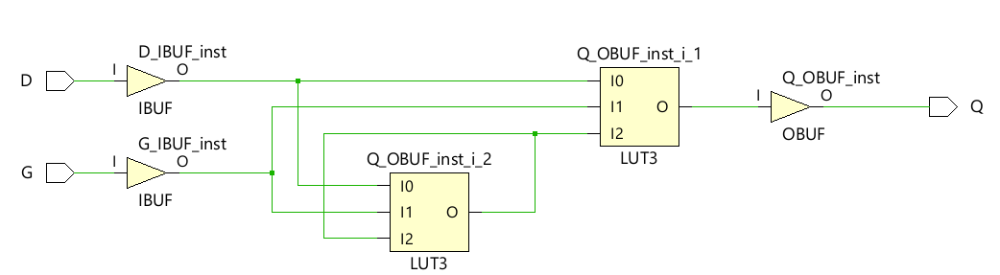
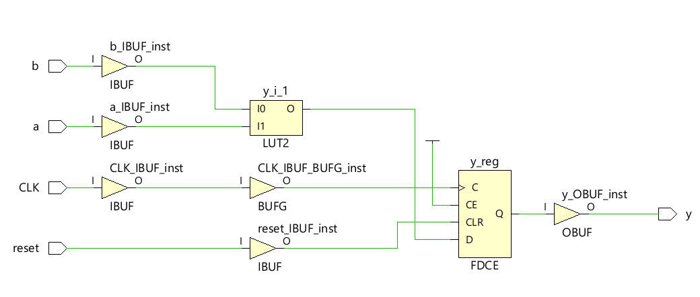
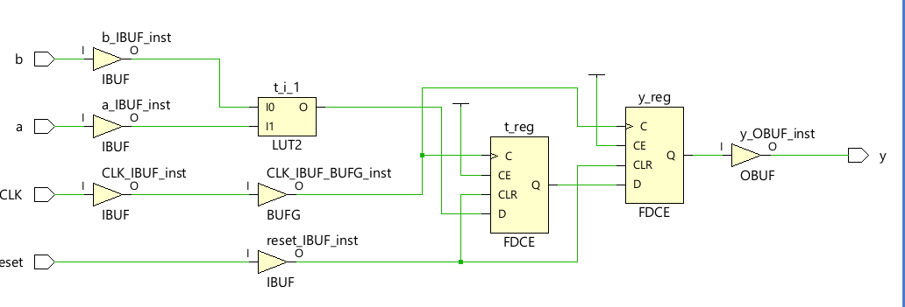

# Assigment 3  

**1.1** 
```vhdl
entity latch is
    Port ( D : in STD_LOGIC;
           G : in STD_LOGIC;
           Q : out STD_LOGIC);
end latch;

architecture latch_behavior of latch is
    signal Dn, Sn, Rn, Qn, Q_internal : std_logic;
begin
    Dn <= not D;
    Sn <= D nand G;
    Rn <= Dn nand G;
    Qn <= Rn nand Q_internal;
    Q_internal <=  Sn nand Qn;
    Q <= Q_internal;
    
end latch_behavior;
```

This code synthesized to become this circuit:




**1.2**
    An example is in a process if you have an if-statement without an else with a default value.

**1.3**
    Make sure all input cases have a defined output. Combinatorial circuits provide this by default, but in a process it has to be specified. 

**2.1**
    We think design 1 makes use of the register due to having to hold the value of t over to different clock cycle.
    
**2.2**



we tried to understand why they implement the respective VHDL designs correctly

**2.3**
    If the value has to be retain over one clock cycle

**2.4** 
    Tri state buffer eller muxer eller noe sånt has to be used to be able to write to the register. 
    If two signals try to update one signal/variable at the same time this might cause an undefined value. 
    Yes multiple variables or signals can be read by more than one process

**3.1**
    If 'b' is not in sensitivity list, y might not be correct. 


**3.2** 
    If we get this error code. There is a difference between the simulated and generated circuit. This comes from simulations need to have a sensitivity list.
    The real circuit does not need this. As the signals may always change later variabels and signals. 
    The simulation needs to know what variabels/signals may cause a change in the system. 

**3.3**
    Add 'b' to the sensitivity list.

**4.1**
   There might be oscillations in the generated circuit, but not discovered in the simulation if there is an incomplete sensitivity list.
   This is a consequence of the simulation not being aware of all the signals that might change.
   f.eks In the circuit shown in fig.4 if I1 is not part of sensitivity list, the Signal O will not updated I1.
   Not indicating the oscillations in the circuit under simulation.

**4.2**
    In conditions where one can guarantee a stable system. e.g negative feedback system
    It is allowed if you want an oscillating system.
    Generally worth to avoid.


