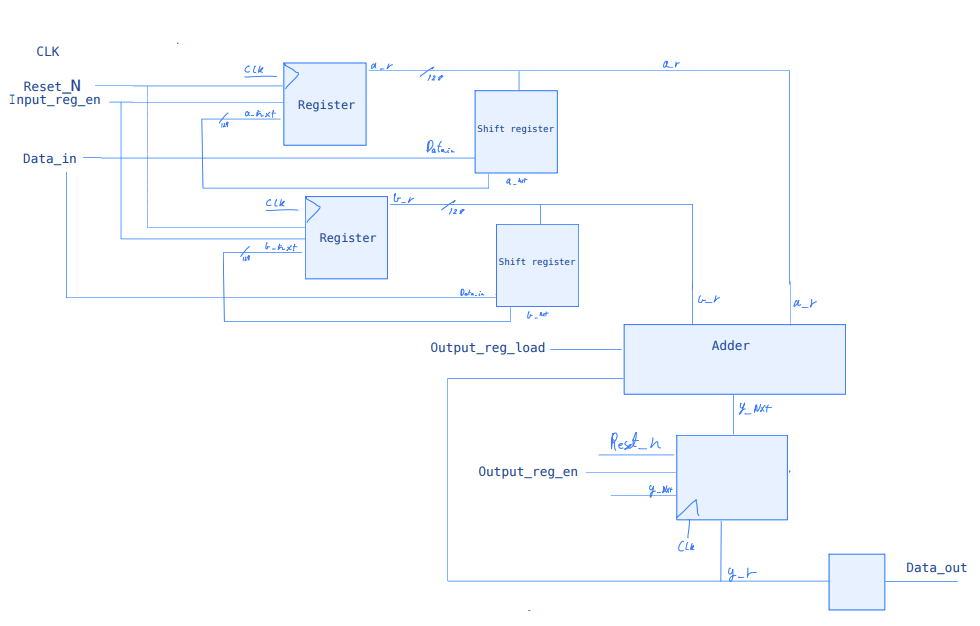
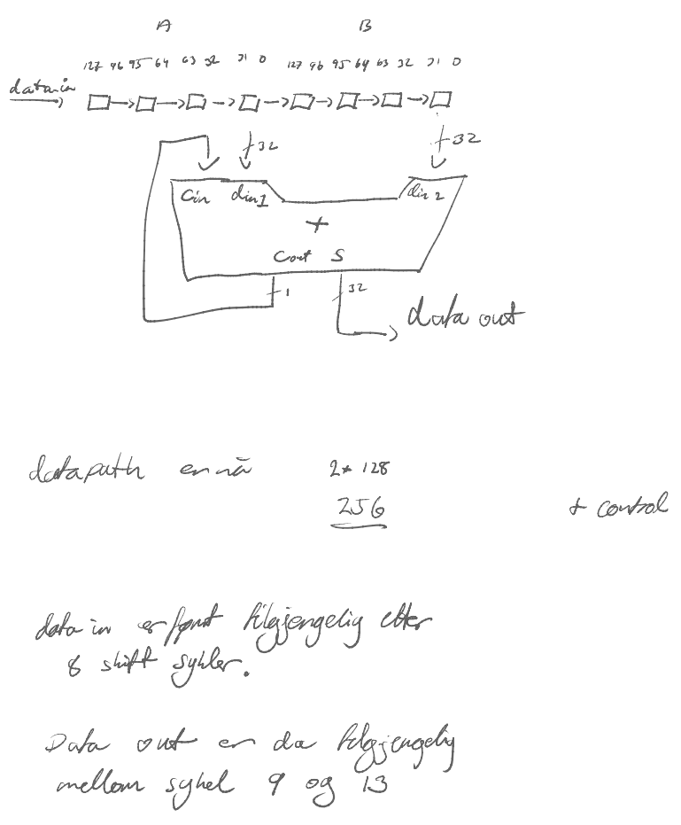

# Assignment 4
### Task 1

### task 2

Here the number was calculated using the code and testbench and manually added together. picture shoes the manuall adding. 
### Task 3
First we thought there was 13 inferred flip flops, but after some reading we understand that vivado counts a single bit in a 128 bit instance as one register. 
There was 391 inferred flip flops. 7 in the controller, and 384 in the datapath. - hvorfor 6 i LF????

### Task 4
Calculated from the 200 MHz clock frequency minus the worst negative slack (WNS) from the timing report: 
166 MHz

### Task 5

### Task 6
