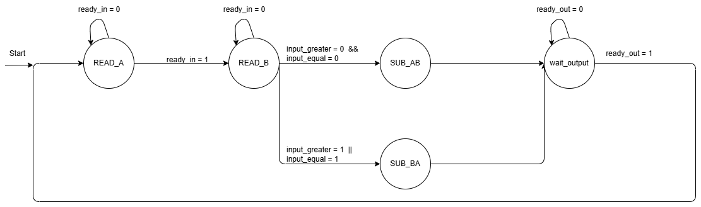

# Assignment 5


## Task 1
```c
uint input(void)
{
    set_ready_in(1);
    while(!valid_in) wait();
    int val = read_bus_in();
    set_ready_in(0)
    return val;
}

void output(uint val)
{
    write_bus_out(val);
    set_valid_out(1);
    while(!ready_out) wait;
    set_valid_out(0);
}

void main(void)
{
    uint input_A, input_B, result;
    while(1)
    {
        input_A = input(); 
        input_B = input();
        result = (input_A > input_B) : input_A - input_B ? input_B - input_A;
        output(result);
    }
}
```

## Task 2 



| **state**   	| **next state** 	| **condition**                    	                    | **actions**                          	|
|-------------	|----------------	|------------------------------------------------------ |--------------------------------------	|
| read_A      	| read_A         	| valid in = 0                     	                    | ready in <- 1                        	|
| read_A      	| read_B         	| valid in = 1                     	                    | ready in <- 1 & write input to reg 0 	|
| read_B      	| read_B         	| valid in = 0                     	                    | ready in <- 1                        	|
| read_B      	| subAB          	| valid in = 1 & (input_greater or input_equal)      	| ready in <- 1 & write input to reg 1 	|
| read_B      	| subBA          	| valid in = 1 & not(input_greater or input_equal)      | ready in <- 1 & write input to reg 1 	|
| subAB       	| wait_output    	| none    	                                            | Data_out = reg_0 - reg_1             	|
| subBA       	| wait_output    	| none                             	                    | Data_out = reg_1 - reg_0             	|
| wait_output 	| wait_output    	| ready out = 0                    	                    | valid out = 1                        	|
| wait_output 	| read_A         	| ready out = 1                    	                    | valid out = 1                        	|


## Task 3 

```vhdl
main_statem_proc : process (state,valid_in,ready_out,input_equal,input_greater)
	begin
		--default values
		--included at the as to make it unessesarry to specify in every state
		--this may hide errors, but prevents unintended latches
		opcode 			<= alu_load;
		read_a_select 	<= read_reg0;
		read_b_select 	<= read_reg0;
		ready_in 		<= '0';
		valid_out 		<= '0';
		state_next 		<= READ_A;
		write_select 	<= write_none;
		
		--main implementation of statemachine
		case(state) is
		    when READ_A =>
		        ready_in <= '1';
		        if(valid_in) then
		          write_select    <= write_reg0;
		          read_a_select   <= read_input;  
		          opcode          <= alu_load;
		          state_next      <= READ_B;
		         else
		          state_next      <= READ_A;
		         end if;
		         
		    when READ_B =>
		        ready_in <= '1';
		        if(valid_in) then
		          write_select  <= write_reg1;
		          read_a_select <= read_input;  
		          read_b_select <= read_reg0;
		          opcode        <= alu_load;
		          
		          if(input_greater or input_equal) then
		           state_next <= SUB_AB;
		          else
		           state_next <= SUB_BA;
		          end if;
		           
		         else
		          state_next <= READ_B;
		         end if;
		         
		    when SUB_AB =>
		         read_b_select    <= read_reg0;
		         read_a_select    <= read_reg1;
		         opcode           <= alu_sub;
		         write_select     <= write_output;
		         state_next       <= WAIT_OUTPUT;
		         
		    when SUB_BA => 
		         read_b_select    <= read_reg1;
		         read_a_select    <= read_reg0;
		         opcode           <= alu_sub;
		         write_select     <= write_output;
		         state_next       <= WAIT_OUTPUT;
		    when WAIT_OUTPUT => 
		         valid_out        <= '1';
		         if(ready_out) then
		          state_next      <= READ_A;
		         else 
		          state_next      <= WAIT_OUTPUT;
		         end if;
			when others =>
				read_a_select 	<= read_reg0;
				read_b_select 	<= read_reg0;
				write_select 	<= write_none;
				valid_out 		<= '0';
				ready_in 		<= '0';
				opcode 			<= alu_load;
				state_next 		<= READ_A;
		end case;
	end process main_statem_proc;
```


## Task 4
The implemented design passed all tests.